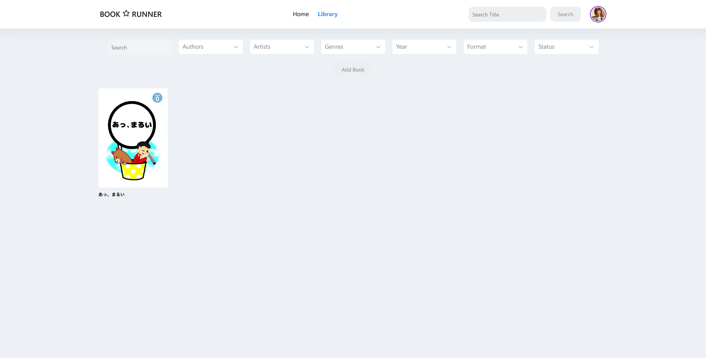

<h1 align="center">
    
    </a>
    
    </a>
</h1>

<p align="center">
  <i align="center">Easily add and read books 📖</i>
</p>

<p align="center">
    
</p>

## Introduction

`Bookrunner` is an open-source book management system and viewer crafted to be simple to setup and use.

### Why?

Why not make your own tools? While there are great open source tools like Calibre, which also have a third-party front end, I wanted to get more granular control over my books. I wanted to set the design of the site and the structure of the api. While there aren't as many robust features like Calibre has, the ease of use is much better in my opinion.

Everyone loves self hostable projects right? Right...?

## Development

<details open>
<summary>
Pre-requisites
</summary> <br />
To be able to start development on bookrunner make sure that you have the following pre-requisites installed:

###

- Node.js v16 or above
- Git
</details>

<details open>
<summary>
Running Amplication
</summary> <br />

###

1. Clone the repository and install dependencies
```shell
git clone https://github.com/Nicocchi/bookrunner.git && cd bookrunner
```

2. Client
```shell
cd client && npm install
```

3. Server
```shell
cd server && npm install
```

### Environment Variables

Before running you need to setup environment variables

#### Client
```
VITE_API_URL: <server url here>
VITE_APP_MODE: <staging or anything else>
```

#### Server
```
DATABASE_URL = <mongodb url here>
```

### Running

#### Server

```shell
cd server && npm run dev
```

#### Client

```shell
cd client && npm run dev
```

## Building Client

```shell
cd client && npm run build
```
The development environment should now be set up. 
</details>